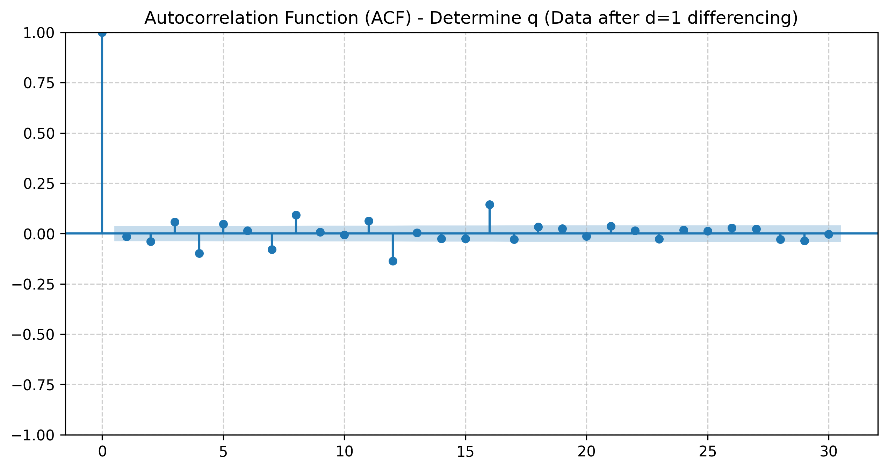
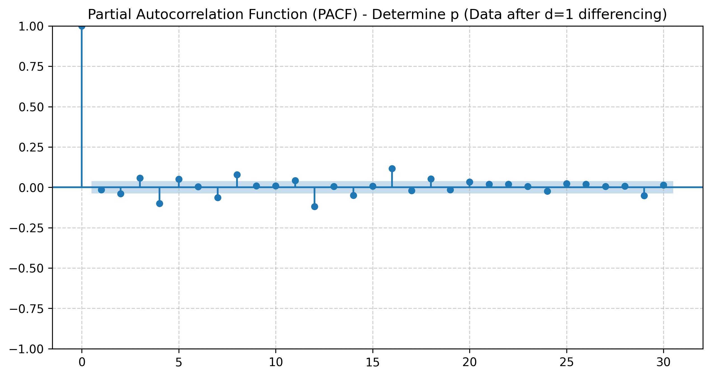
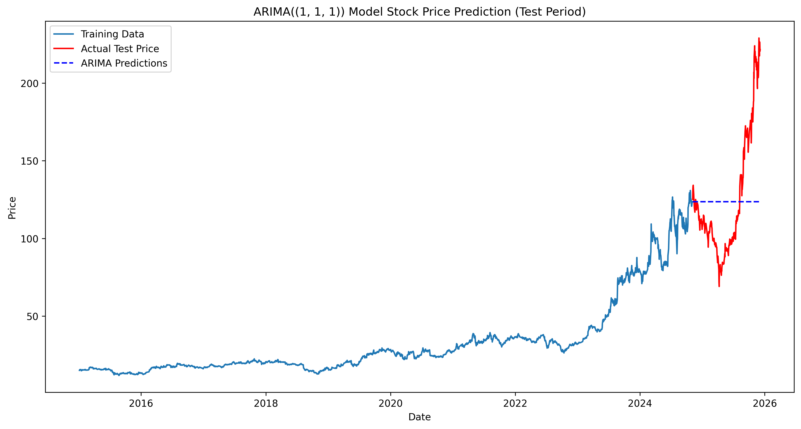
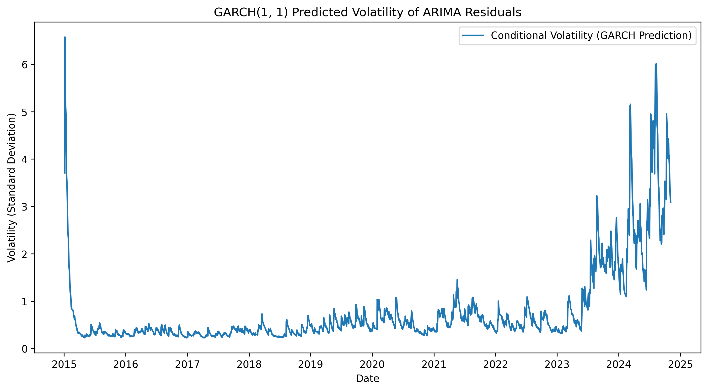

# 📈 Project 10：ARIMA-GARCH 金融時間序列預測與風險分析

## 🎯 專案概述 (Project Overview)

本專案實作了 **ARIMA-GARCH 組合模型**，對具有強烈趨勢與高波動特徵的股票收盤價（**代號：2449**）進行均值預測和波動度分析。旨在建立一個強大且穩定的框架來：

1. **結構建模：** 建立 ARIMA(1, 1, 1) 模型，成功捕捉序列的長期趨勢結構。
2. **波動度分析：** 應用 GARCH(1, 1) 模型，捕捉金融數據特有的**波動度叢集 (Volatility Clustering)** 現象。
3. **風險量化：** 基於 GARCH 預測的波動度，計算 VaR (Value at Risk) 進行量化風險評估。
4. **數據穩健性：** 建立自動化數據管道，確保分析數據源 100% 的清潔與連續性。

---

## 🛠️ 數據工程與穩健性 (Data Engineering & Robustness)

本專案的核心挑戰之一，是確保時序數據的**一致性**和**連續性**。為此，我們設計了一個強大的自動更新腳本（`update_data.py`），展示了解決以下現實數據工程難題的能力：

| 挑戰類型 | 實際問題 | 專業解決方案 |
| :--- | :--- | :--- |
| **欄位錯位** | CSV 檔案中存在**多餘的 Header** 和**幽靈逗號**，導致新舊數據無法對齊。 | 腳本使用 Pandas `usecols=range(6)` **強制結構化讀取**，無視所有多餘污染，確保 100% 欄位對齊。 |
| **數據污染** | yfinance 數據寫回 CSV 時，產生**多層次欄位結構**污染。 | 程式碼在下載與儲存時，**強制確保 DataFrame 結構只有 5 個必需欄位**，徹底杜絕重複污染。 |
| **NaT 錯誤** | Excel/Calc 編輯導致日期格式不一致，引發 NaT (Not a Time) 索引錯誤。 | 採用 `pd.notna(old_df.index)` 機制，**強行移除所有無效的 NaT 記錄**，確保數據連續性。 |

---

## 🔬 分析流程與模型參數 (Methodology)

本專案嚴格遵循標準的時間序列分析流程，確定最佳模型參數 $\mathbf{(p, d, q) = (1, 1, 1)}$。

### 步驟 1-3：數據準備與參數識別

| 步驟 | 工具/結果 | 專業結論 |
| :--- | :--- | :--- |
| **穩定性檢驗** | **ADF 檢驗結果：** 原始序列不穩定 $(\text{P-value} \approx 1.0)$，一階差分後穩定 $(\text{P-value} \approx 0.0)$。 | 確定整合階數 $\mathbf{d=1}$。 |
| **ACF / PACF 分析** | ACF 圖截尾於 Lag 1，PACF 圖截尾於 Lag 1。 | 確定自迴歸 $\mathbf{p=1}$ 和移動平均 $\mathbf{q=1}$。 |

### 🔍 參數識別圖表 ($\mathbf{d=1}$ 序列)

以下圖表用於確認 $\mathbf{p=1}$ 和 $\mathbf{q=1}$：

**ACF 圖 (確定 q):**

**PACF 圖 (確定 p):**

---

### 步驟 4：ARIMA(1, 1, 1) 訓練與預測視覺化

模型在 $10\%$ 測試集上的 $\text{RMSE}$ 約為 $\mathbf{40.04}$，顯示預測誤差仍高，但結構診斷合格。

**ARIMA 價格預測視覺化 (訓練集 vs. 測試集預測):**

| 指標 | 數值 | 診斷判讀 |
| :--- | :--- | :--- |
| **均方根誤差 ($\text{RMSE}$)** | $\mathbf{40.0397}$ | 預測誤差與數據標準差 ($\approx 38.5$) 相當，顯示**模型預測精度仍有提升空間**。 |
| **Ljung-Box (Q)** | $\text{Prob(Q)} = 0.93$ | **通過**。ARIMA 成功移除了殘差中的自相關性（均值結構捕捉成功）。 |
| **Heteroskedasticity (H)** | $\text{Prob(H)} = 0.00$ | **未通過**。殘差存在**異質性**（波動度叢集），**必須引入 GARCH 模型**。 |

---

## 💰 風險與波動度建模：GARCH 與 VaR

### GARCH(1, 1) 波動度視覺化

GARCH 模型成功捕捉了市場的波動度叢集現象。

**GARCH 條件波動度視覺化 (展示風險動態):**

| 參數 | 係數 ($\text{coef}$) | 經濟意義 |
| :--- | :--- | :--- |
| **Alpha ($\alpha_1$)** | $0.1381$ | **衝擊敏感度。** 昨日的市場衝擊有 $14\%$ 轉移到今天的波動度。 |
| **Beta ($\beta_1$)** | $0.8612$ | **波動度持續性。** 昨日的波動狀態有 $86\%$ 會持續到今天。 |
| **$\alpha_1 + \beta_1$** | $\mathbf{0.9993}$ | **極強的波動度記憶性**。一旦進入高波動期，會非常緩慢地回歸平均水準，證實了該股的波動度叢集效應。 |

### VaR 風險量化 (Value at Risk)

基於 GARCH 預測的條件波動度，計算 95% 信心水準下的風險價值。

| 指標 | 結果 ($\text{h}+1$) | 解讀 |
| :--- | :--- | :--- |
| **條件標準差** | $\approx 2.88$ (元/股) | 預測下一交易日股價的平均波動幅度。 |
| **95% VaR** | $\mathbf{-4.7516}$ (元/股) | 我們有 **95% 的信心**，在預測的第一個交易日，單股的**最大損失不會超過 $\mathbf{4.75}$ 元**。 |

---

## ⚠️ 專業模型限制揭露

| 限制面向 | 專案結果 | 專業判斷與建議 |
| :--- | :--- | :--- |
| **長期價格預測** | 30 天內價格從 $221.50$ **飆升至 $3930.87$**。 | **結果不可信。** 由於 ARIMA 的 $I(1)$ 參數會導致趨勢無限疊加，此結果僅表示數據具有**極強的動量 (Momentum) 慣性**。 |
| **模型缺陷** | RMSE 佔平均價格的 $95\%$。 | 模型在預測**價格點**上效果不佳。建議將分析重點放在**風險 (GARCH/VaR)**，而非絕對價格預測。 |
| **優化方向** | ARIMA | 建議改用對數報酬率序列 (Log Returns) 訓練 **ARMA(p, q)** 模型，以納入金融序列的**均值迴歸**假設。 |
